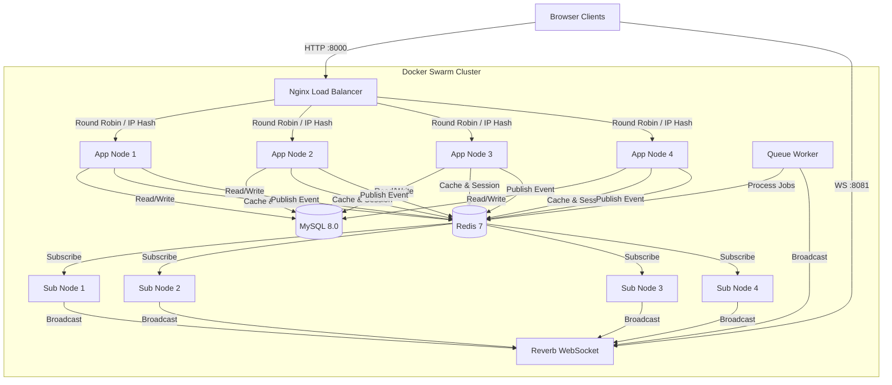

# Docker Swarm Architecture: Distributed Attendance System

Dokumen ini menjelaskan arsitektur final dari Sistem Absensi Terdistribusi yang telah diimplementasikan. Arsitektur ini dirancang untuk High Availability, Scalability, dan Real-Time Updates.

---

## 🏗️ Arsitektur Final (Implemented)

Sistem ini menggunakan arsitektur **Microservices-like** di dalam Docker Swarm, dengan pemisahan tanggung jawab yang jelas antara HTTP handling, WebSocket, dan Background Jobs.

---

## 🧩 Komponen & Service

Berikut adalah daftar 14 service yang berjalan dalam stack `sistemabsensi`:

### 1. Load Balancer & Proxy
*   **Service**: `nginx`
*   **Port**: 8000 (HTTP)
*   **Fungsi**: Mendistribusikan traffic HTTP ke 4 App Nodes menggunakan algoritma `ip_hash` (Sticky Session).
*   **Konfigurasi**: Menggunakan `nginx.conf` custom yang mendefinisikan upstream ke `app-node-1` s/d `app-node-4`.

### 2. Application Nodes (HTTP)
*   **Services**: `app-node-1`, `app-node-2`, `app-node-3`, `app-node-4`
*   **Port**: 9000 (Internal PHP-FPM)
*   **Fungsi**: Menangani request HTTP (Login, Absen, Dashboard).
*   **Keunikan**: Setiap node memiliki `APP_NODE_ID` yang unik untuk identifikasi di database dan logs.

### 3. Subscriber Nodes (Event Listeners)
*   **Services**: `subscriber-node-1`, `subscriber-node-2`, `subscriber-node-3`, `subscriber-node-4`
*   **Command**: `php artisan redis:subscribe`
*   **Fungsi**: Mendengarkan event Redis Pub/Sub dari App Nodes lain dan mem-broadcast ke WebSocket. Ini memastikan event yang terjadi di Node 1 bisa didengar oleh user yang connect ke Node 4.

### 4. Real-Time Infrastructure
*   **Service**: `reverb`
*   **Port**: 8081 (WebSocket External), 8080 (Internal)
*   **Fungsi**: Server WebSocket native Laravel. Mengelola koneksi real-time ke browser.
*   **Service**: `queue-worker`
*   **Fungsi**: Memproses job background dan broadcast event yang berat agar tidak memblokir request HTTP.

### 5. Database & Cache
*   **Service**: `mysql`
*   **Port**: 3307 (External), 3306 (Internal)
*   **Fungsi**: Penyimpanan data utama (User, Attendance).
*   **Service**: `redis`
*   **Port**: 6379
*   **Fungsi**:
    *   **Session Store**: Menyimpan login session (agar user tidak logout saat pindah node).
    *   **Cache**: Menyimpan data sementara.
    *   **Queue**: Antrian job.
    *   **Pub/Sub**: Jalur komunikasi antar-node.

### 6. Utility
*   **Service**: `migration`
*   **Fungsi**: Menjalankan `php artisan migrate` sekali saat startup untuk memastikan database schema terbaru. Service ini akan mati (Exit 0) setelah selesai.

---

## 🔄 Alur Data (Data Flow)

### Skenario: User Melakukan Absensi

1.  **Request**: User klik "Clock In" di browser.
2.  **Load Balance**: Nginx mengarahkan request ke `app-node-2` (misalnya).
3.  **Process**: `app-node-2` menyimpan data ke MySQL.
4.  **Publish**: `app-node-2` mem-publish event `AttendanceCreated` ke channel Redis `absensi-events`.
5.  **Distribute**: Redis menyebarkan event ke semua Subscriber Nodes.
6.  **Broadcast**: `subscriber-node-X` menerima event, lalu mengirim sinyal ke Reverb Server.
7.  **Push**: Reverb mem-push data JSON baru ke semua browser yang sedang membuka Dashboard Admin.
8.  **Update**: Dashboard Admin di browser user lain (yang mungkin connect ke Node 4) langsung terupdate tanpa refresh.

---

## ⚙️ Konfigurasi Docker Swarm

File `docker-stack-production.yml` menggunakan konfigurasi berikut:

*   **Network**: `absensi-overlay` (Driver: overlay). Memungkinkan container berkomunikasi lintas host (jika multi-node swarm).
*   **Replicas**:
    *   App Nodes: 1 per service (Total 4)
    *   Subscribers: 1 per service (Total 4)
    *   Lainnya: 1 replica
*   **Restart Policy**: `condition: on-failure`. Container akan otomatis hidup lagi jika crash.
*   **Update Config**: `parallelism: 1`, `delay: 10s`. Rolling update (update satu per satu tanpa downtime).

---

## 🛡️ Security & Production Notes

Dalam implementasi ini, kita menggunakan `.env` file untuk kemudahan simulasi. Untuk deployment production yang sebenarnya ("Hardened Production"), disarankan:

1.  **Docker Secrets**: Mengganti `.env` dengan `docker secret` untuk password DB dan API Keys.
2.  **SSL/TLS**: Mengaktifkan HTTPS di Nginx dan WSS di Reverb.
3.  **Resource Limits**: Menambahkan `deploy.resources.limits` (CPU/RAM) untuk mencegah satu container memakan semua resource host.
4.  **Dedicated Nodes**: Memisahkan Database dan Redis ke server fisik/cloud terpisah (Managed Database) untuk performa lebih baik.
